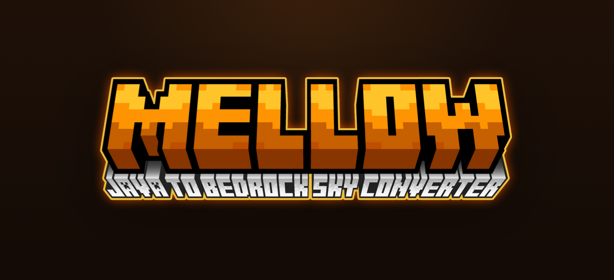
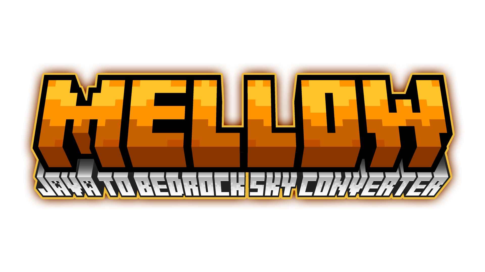

# 🌅 Mellow | Java to Bedrock Sky Converter

**Mellow** is a modern web tool built to convert Java Edition sky textures into Bedrock Edition compatible cubemaps. Fast, secure, and server-free conversion right in your browser.

## ✨ Features
* **Seamless conversion:** Works directly in your browser with no server-side processing.
* **Modern UI:** Dark mode with orange/gold accents and subtle motion.
* **Sky presets:** Choose from common sky texture names or enter a custom filename.
* **Responsive design:** Clean layout for desktop and mobile screens.
* **Automatic detection:** Scans ZIP files for sky textures in standard paths.

## 🚀 Usage
1. Visit [mellow.misumeh.com](https://mellow.misumeh.com).
2. Upload a Java Edition `.zip` resource pack.
3. Select the skybox filename from the dropdown or choose **Custom**.
4. Click **Convert** and download the generated `.mcpack`.

## 🛠 Setup (For Developers)
To run locally:
1. Clone the repo: `git clone https://github.com/yourusername/mellow.git`
2. Open `index.html` in your browser (no build required).

## 🤝 Community & Support
- Join our Discord for discussions and support: [https://discord.gg/mjYWM4JbVn](https://discord.gg/mjYWM4JbVn)
- Report issues or suggest features on [GitHub Issues](https://github.com/yourusername/mellow/issues).

If you want to support the project, consider donating via Ko-fi:  
[Support me on Ko-fi](https://ko-fi.com/misumeh)

## 🛠 Built By
Developed by **Misumeh**.

## ⚖️ License
This project is released under the MIT License. Feel free to fork and improve.

## 📋 Roadmap
- Batch conversion for multiple sky files
- Support for additional texture formats
- Improved error handling and validation
